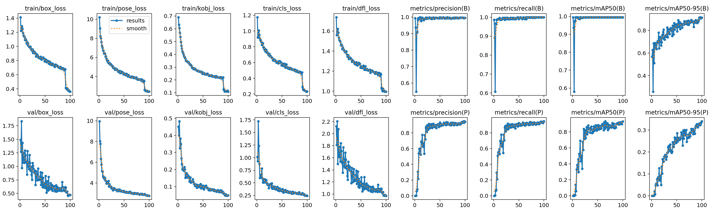
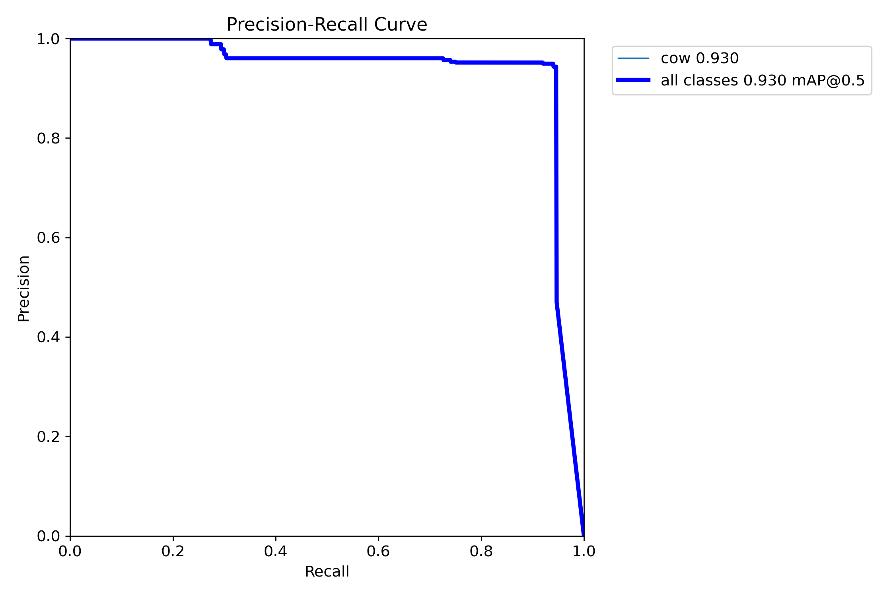

# Biometric Cattle Detection & Behavioral Analysis

**Lead Researcher:** Abdulhamid Daghistani  
**Academic Institution:** University of Guelph, School of Engineering  
**Project Scope:** Development of a high-precision pose estimation pipeline for identifying illness-related gait markers in livestock.

---

## 📌 Project Overview
This project utilizes the **YOLOv8-Pose architecture** to automate the detection of cattle and the localization of anatomical keypoints. The ultimate goal is to move from static spatial detection to **temporal behavioral analysis**, allowing for the early identification of lameness and other health issues through gait analysis.

## 🛠 Technical Methodology

### 1. Data Sourcing & Curation
* **Source:** Initial manual annotation was conducted via **DeepLabCut**, but was pivoted to an open-source **Roboflow** dataset to overcome annotation bottlenecks.
* **Cleaning:** The dataset was curated to remove frames with ambiguous or unlabeled cattle to prevent "background confusion" during training.
* **Augmentation:** Applied **Mosaic augmentation**, random **flipping**, and **rotations** to the training pipeline to prevent the model from overfitting to specific background environments.

### 2. Model Architecture
* **Framework:** Ultralytics YOLOv8-Pose.
* **Input Resolution:** 640px.
* **Optimization:** Utilized `multiprocessing.freeze_support()` for Windows stability and tuned batch sizes to fit available VRAM.

---

## 📊 Performance Metrics

### Training Results (Model: `train6`)
The following graphs demonstrate the model's convergence and precision after applying anti-memorization techniques.

| Metric | Value | Interpretation |
| :--- | :--- | :--- |
| **Box mAP@50** | **0.99** | Near-perfect subject localization and bounding box stability. |
| **Pose mAP@50** | **0.93** | High accuracy in identifying primary anatomical keypoints. |
| **Pose mAP@50-95** | **0.35** | Current area for improvement: strict pixel-level localization precision. |

#### Training Loss & mAP

*Figure 1: Training and Validation loss curves showing consistent downward trends.*

#### Precision-Recall Curve

*Figure 2: The model achieved a mAP@0.5 of 0.930 for keypoint localization.*

---

## 🔍 Visual Validation

### Generalization Test
The model has been tested on diverse footage (including external cattle footage) featuring different breeds and lighting conditions to ensure the model is not memorizing training backgrounds.

#### Validation Batch

*Figure 3: Predictions showing stable bounding boxes and keypoint placement across multiple subjects.*

---

## 🚀 Future Goals & Roadmap

### Phase 1: Keypoint Refinement
* **Cropping-Refinement Loop:** Implementing a pipeline that re-feeds detected bounding boxes into the model at higher resolution to improve pixel-level accuracy.
* **Iterative Auto-Annotation:** Utilizing the current model to semi-automatically label new footage, followed by manual correction of keypoint offsets to increase dataset diversity.

### Phase 2: Behavioral Analysis
* **Temporal Classifier:** Development of a classifier to analyze the sequence of keypoint movements over time rather than single frames.
* **Gait Extraction:** Measuring joint angles and stride timing to identify deviations indicative of early-stage lameness.

---

## 💻 Installation & Usage

```bash
# Install dependencies
pip install ultralytics

# Run validation on new footage
yolo task=pose mode=val model=models/train6/weights/best.pt data=data.yaml imgsz=640


